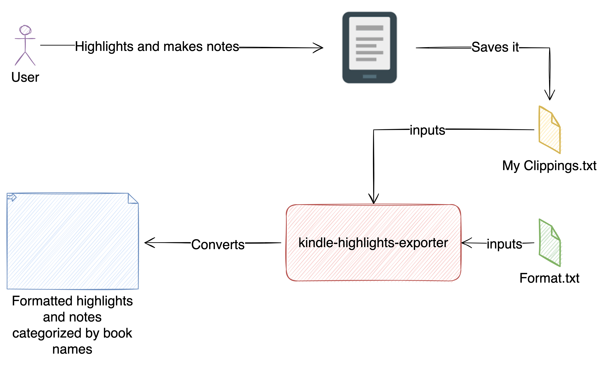

# Getting Started



Copy the `My Clippings.txt` from Kindle to your local directory then use following commands to execute it. 

The format file can be changed by using the following placeholders:
```
{page}
{text}
{type}
{author}
{createdOn}

```

Command to run it:


```shell
mvn clean install
java -Dfile.encoding="UTF-8" -jar ./target/kindle-highlights-exporter-0.0.1-SNAPSHOT.jar -s ./My\ Clippings.txt -f ./format.txt
```

### Reference Documentation

For further reference, please consider the following sections:

* [Official Apache Maven documentation](https://maven.apache.org/guides/index.html)
* [Spring Boot Maven Plugin Reference Guide](https://docs.spring.io/spring-boot/docs/2.7.3/maven-plugin/reference/html/)
* [Create an OCI image](https://docs.spring.io/spring-boot/docs/2.7.3/maven-plugin/reference/html/#build-image)
* [Picocli](https://picocli.info/#_spring_boot_example)

